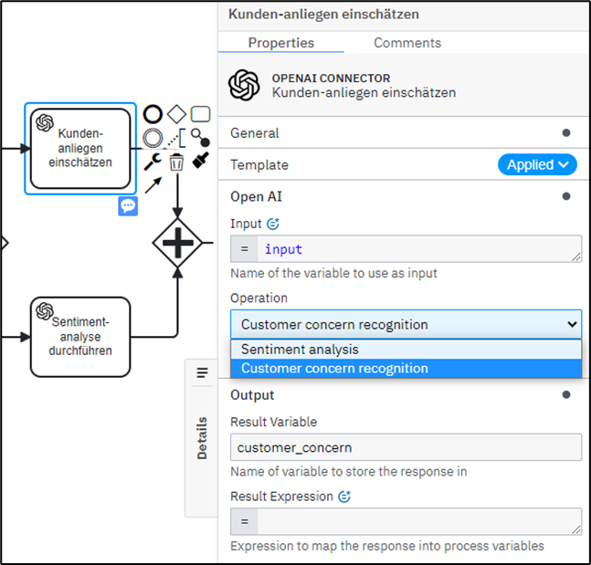

# zeebe-openai-demo-connector

## :rocket: Description
This is a zeebe-connector demo-application that connects a custom Camunda 8 Connector to the OpenAi platform usind the [Connector SDK](https://docs.camunda.io/docs/components/connectors/custom-built-connectors/connector-sdk/).
The openai-connector offers to very specialized operations: First, it is able to classify customer concerns, 
and second, it can perform a sentiment analysis for a given input. Both using German language.

## :bulb: Connector Template
The [Connector template](https://docs.camunda.io/docs/components/connectors/custom-built-connectors/connector-templates/)
stored in [zeebe-openai-demo-connector.json](connector-template/zeebe-openai-demo-connector.json) provides 
anything that is needed for the connector to be added to a Camunda 8 cluster. After deploying the resource using the web-modeler
the OpenAi-Connector can be used in any process-model of the resp. project: 

The Connector needs two required inputs:

1. The variable the input is taken from
2. The operation that should be performed  

The 'Result Variable'-attribute specifies the variable the result is stored in, or a "Result Expression" can be used.

</img>

## :electric_plug: Connector
The conector itself is a Spring-Boot-Application that starts the OpenAi-Connector as `ConnectorJobHandler` using
a `ZeebeClient`. It needs the following environment variables in order to work 
(cp. [application.yaml](src/main/resources/application.yaml))

1. `ZB_REGION`: Region
2. `ZB_CLUSTER`: Cluster-Id
3. `ZB_CLIENT`: Client-Id
4. `ZB_SECRET`: Client-Secret

These values can be obtained from your C8 cluster.

5. `OPEN_AI_TOKEN`: Access-Token for the OpenAi platform

This value can be obtained from your OpenAi account.   

Afterwards the Spring-Boot-Application can be started, and it executes jobs of type `de.viadee.bpm.zeebe.connector:openai:1`
like specified in the [connector-template](connector-template/zeebe-openai-demo-connector.json) and in [OpenAiConfig.java](src/main/java/de/viadee/bpm/zeebe/config/OpenAiConfig.java) 

## :paperclip: Note
The versions of this demo are not maintained, i.e. dependencies might be outdated sometime.
Please be aware, that older versions might contain vulnerabilities.

## :wave: Collaboration & Feedback
If you have any feedback, ideas or extensions feel free to contact or create a GitHub issue. 
If you are interested to find out what else we are doing, check out our website [viadee.de](https://www.viadee.de/en).

## :key: License

